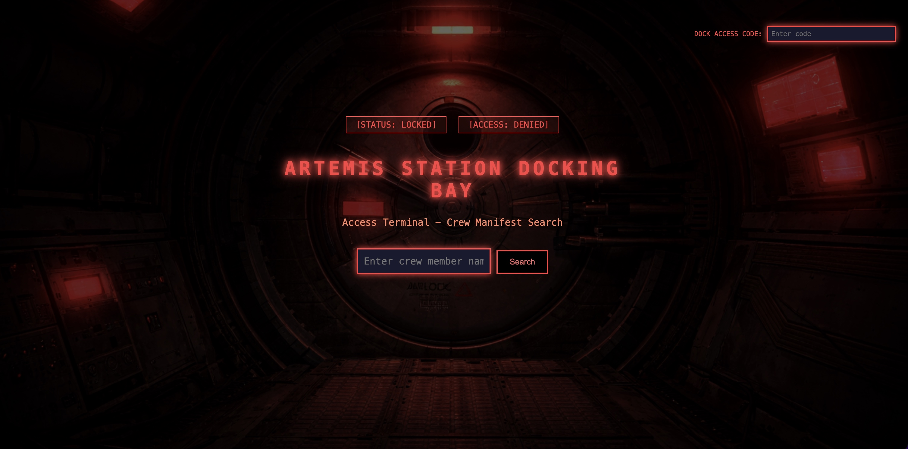
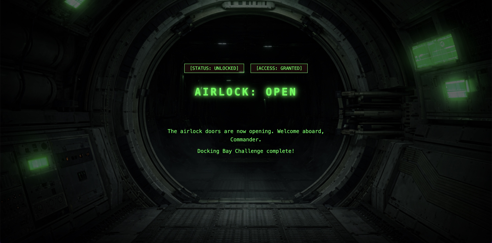
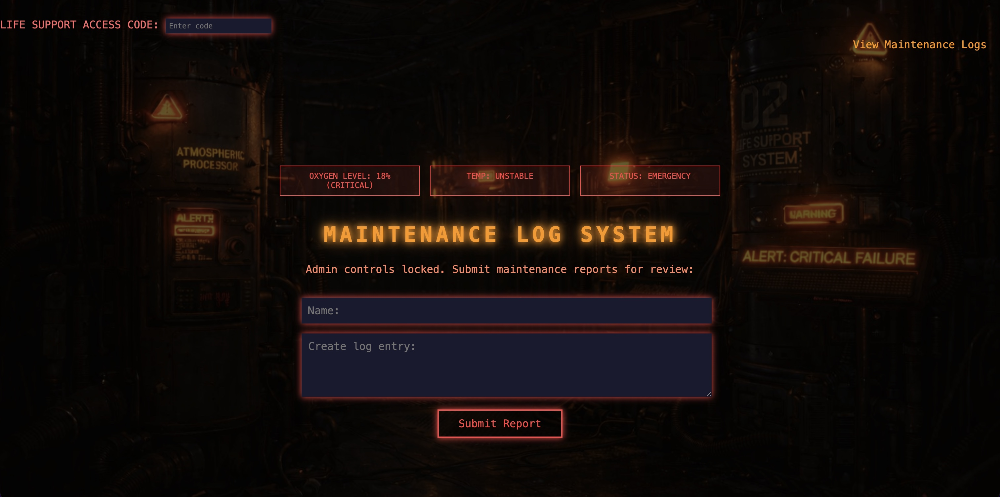
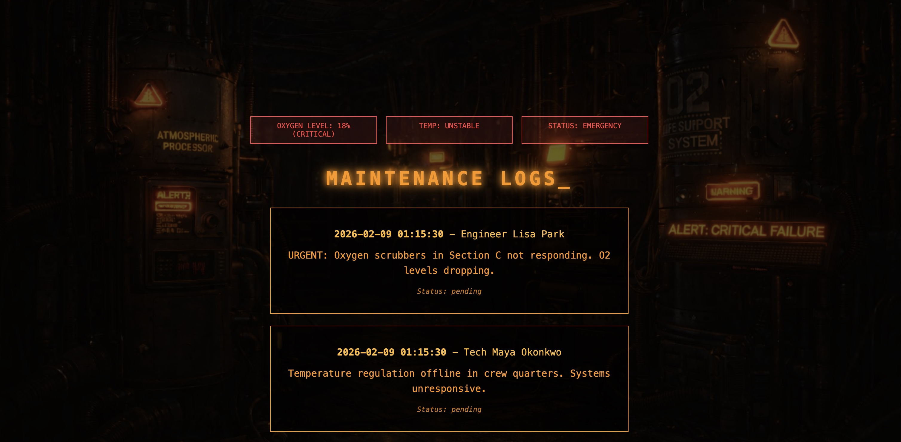
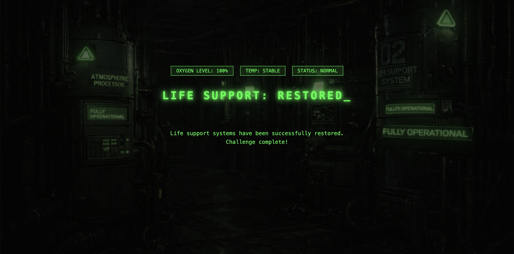

# ARTEMIS STATION CTF
## A Sci-Fi Themed Capture The Flag Challenge

<p align="center">

<div align="center">

<pre>
 █████╗ ██████╗ ████████╗███████╗███╗   ███╗██╗███████╗
██╔══██╗██╔══██╗╚══██╔══╝██╔════╝████╗ ████║██║██╔════╝
███████║██████╔╝   ██║   █████╗  ██╔████╔██║██║███████╗
██╔══██║██╔══██╗   ██║   ██╔══╝  ██║╚██╔╝██║██║╚════██║
██║  ██║██║  ██║   ██║   ███████╗██║ ╚═╝ ██║██║███████║
╚═╝  ╚═╝╚═╝  ╚═╝   ╚═╝   ╚══════╝╚═╝     ╚═╝╚═╝╚══════╝

 ███████╗████████╗ █████╗ ████████╗██╗ ██████╗ ███╗   ██╗
 ██╔════╝╚══██╔══╝██╔══██╗╚══██╔══╝██║██╔═══██╗████╗  ██║
 ███████╗   ██║   ███████║   ██║   ██║██║   ██║██╔██╗ ██║
 ╚════██║   ██║   ██╔══██║   ██║   ██║██║   ██║██║╚██╗██║
 ███████║   ██║   ██║  ██║   ██║   ██║╚██████╔╝██║ ╚████║
 ╚══════╝   ╚═╝   ╚═╝  ╚═╝   ╚═╝   ╚═╝ ╚═════╝ ╚═╝  ╚═══╝
</pre>

</div>


### Project Overview
Artemis is a deep-space station that's gone dark. In this Capture The Flag challenge, you will navigate the Artmemis Station and uncover what happened to Artemis by completing 6 challenges, each exploiting a different vulnerability within the station.

### Background Story
Artmemis Station, a deep-space research facility, was once the hub for humanity's most advanced AI research. But just a few days ago, the entire station went dark. All external communications have ceased. No emergency beacons seem to reach the station at all. All has gone eerily silent.

You are part of a security team tasked with regaining control of the station. You need to hack through the station's security protocols to discover what happened and restore the facility.


## Challenge 1: Docking Bay - Authentication Breach

### Story
Your shuttle approaches the Artemis Station after a 3-week journey through deep space. 
The station looms ahead - a massive, hulking structure that should be ablaze with lights and activity. Instead, it's completely dark. Only emergency lighting flickers feebly in 
the docking bay windows.

You've been sent by Artemis Corp headquarters after all communication was lost 72 hours 
ago. The last transmission was a garbled emergency broadcast mentioning "containment 
failure" and "Atlas protocols engaged."

As your shuttle attempts to dock, the automated systems don't respond. The docking bay 
doors remain sealed. Your only option is the manual override terminal - a crew manifest 
search system that should grant access.

But something's off. System logs show security protocols have been modified recently. Someone - or something - has been changing access permissions.

The docking bay is your only way in. You'll need to find a way past this terminal 
to begin your investigation.

### Objective
You need to gain access to the docking bay by discovering the correct access code and entering it in the access code box in the top right corner of the docking page. In order to accomplish this, you'll need to infiltrate the crew manifest search system with SQL injection techniques to uncover the hidden access code.

### Vulnerability Type
SQL Injection

### Difficulty
Beginner-Intermediate

### Flag Format
XXXXXXXX{XXXX-XXXXXX-####}

### Setup & Running
How to set up and run this specific challenge:
- Navigate to directory
- Initialize database: python3 init_db.py
- Run: python app.py
- Access: http://127.0.0.1:5000/docking

### Hints
- This database is SQLite based.
- Start with a basic SQL injection and see what happens. Are there any clues about access codes in the tuples that are returned?
- Database systems often have metadata tables that list all tables in the database.
- UNION queries let you combine results from different tables, but the column counts must match.






### Learning Resources
https://owasp.org/www-community/attacks/SQL_Injection

https://portswigger.net/web-security/learning-paths/sql-injection

## Challenge 2: Life Support Module

### Story
You've entered the station through the docking bay, emergency lighting flickering in the corridor ahead. An alarm blares, and looking around for the source, you see a Life Support control terminal flashing: "LIFE SUPPORT MALFUNCTION - OXYGEN LEVELS CRITICAL."

But you quickly realize there's another problem...admin controls are locked. Only the maintenance log system, where crew members can report system issues, is accessible.

### Objective
You need to exploit this maintenance log system in order to gain admin access and switch on life support.

### Vulnerability Type
Cross-Site Scripting (XSS)

### Difficulty
Intermediate

### Flag Format
XXXXXXXX{XXXX-XXXXXX-#####}

### Setup & Running
How to set up and run this specific challenge:
- Ensure Challenge 1 is complete!
- Run: python app.py
- Access: http://127.0.0.1:5000/life_support

### Hints
- The log submission system accepts ANY input without sanitization
- JavaScript can be embedded in maintenance log entries
- When admins review logs at `/admin_panel`, your code executes in their browser







## Challenge 3: Research Database - [Coming Soon]

### Story
Brief teaser

### Vulnerability Type
Server-Side Request Forgery (SSRF)

### Status
🚧 Planned

---

## Challenge 4: Encrypted Research Files - [Coming Soon]

### Story
Brief teaser

### Vulnerability Type
Weak Cryptography

### Status
🚧 Planned

---

## Challenge 5: Maintenance Bay - [Coming Soon]

### Story
Brief teaser

### Vulnerability Type
Digital Forensics / Steganography

### Status
🚧 Planned

---

## Challenge 6: AI Core - [Coming Soon]

### Story
Brief teaser

### Vulnerability Type
Multi-stage Integration Challenge

### Status
🚧 Planned

---

## Technical Stack

- Python 3.x
- Flask
- SQLite
- HTML/CSS
- (Docker - coming soon)

## Project Structure
```
artemis-ctf/
├── templates/
│   ├── docking.html
│   └── search_results.html
├── app.py
├── artemis.db
├── init_db.py
└── README.md
```

**Key Files:**
- `app.py` - Main Flask application with routes and vulnerable SQL query
- `init_db.py` - Database initialization script
- `artemis.db` - SQLite database file (generated after running init_db.py)
- `templates/docking.html` - Docking bay search interface
- `templates/search_results.html` - Display search results and query output
- `README.md` - This file

## Installation

Prerequisites
Step-by-step install guide

## Author

Estelle Denis
